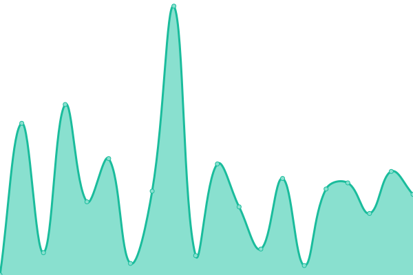

# [📈 Live Status](https://hatchdotlol.github.io/upptime): <!--live status--> **🟧 Partial outage**

This repository contains the open-source uptime monitor and status page for [Hatch](hatch.lol), powered by [Upptime](https://github.com/upptime/upptime).

With [Upptime](https://upptime.js.org), you can get your own unlimited and free uptime monitor and status page, powered entirely by a GitHub repository. We use [Issues](https://github.com/hatchdotlol/upptime/issues) as incident reports, [Actions](https://github.com/hatchdotlol/upptime/actions) as uptime monitors, and [Pages](https://hatchdotlol.github.io/upptime) for the status page.

<!--start: status pages-->
<!-- This summary is generated by Upptime (https://github.com/upptime/upptime) -->
<!-- Do not edit this manually, your changes will be overwritten -->
<!-- prettier-ignore -->
| URL | Status | History | Response Time | Uptime |
| --- | ------ | ------- | ------------- | ------ |
|  [Hatch](https://hatch.lol) | 🟩 Up | [hatch.yml](https://github.com/hatchdotlol/upptime/commits/HEAD/history/hatch.yml) | 

 224ms
     
 | 

<a href="https://status.hatch.lol/history/hatch">86.52%</a>
    

|  [Hatch dev](https://dev.hatch.lol) | 🟩 Up | [hatch-dev.yml](https://github.com/hatchdotlol/upptime/commits/HEAD/history/hatch-dev.yml) | 

 273ms
     
 | 

<a href="https://status.hatch.lol/history/hatch-dev">86.52%</a>
    

|  [Hatch API](https://api.hatch.lol) | 🟩 Up | [hatch-api.yml](https://github.com/hatchdotlol/upptime/commits/HEAD/history/hatch-api.yml) | 

 289ms
     
 | 

<a href="https://status.hatch.lol/history/hatch-api">86.52%</a>
    

|  [Hatch Forums](https://forums.hatch.lol) | 🟩 Up | [hatch-forums.yml](https://github.com/hatchdotlol/upptime/commits/HEAD/history/hatch-forums.yml) | 

 1012ms
     
 | 

<a href="https://status.hatch.lol/history/hatch-forums">69.32%</a>
    

|  [Hatch Wiki](https://wiki.hatch.lol) | 🟩 Up | [hatch-wiki.yml](https://github.com/hatchdotlol/upptime/commits/HEAD/history/hatch-wiki.yml) | 

 691ms
     
 | 

<a href="https://status.hatch.lol/history/hatch-wiki">69.67%</a>
    

|  [Hatch Cloud Data](https://clouddata.hatch.lol) | 🟥 Down | [hatch-cloud-data.yml](https://github.com/hatchdotlol/upptime/commits/HEAD/history/hatch-cloud-data.yml) | 

 225ms
     
 | 

<a href="https://status.hatch.lol/history/hatch-cloud-data">0.00%</a>
    

<!--end: status pages-->

[**Visit our status website →**](https://hatchdotlol.github.io/upptime)

## 📄 License

- Powered by: [Upptime](https://github.com/upptime/upptime)
- Code: [MIT](./LICENSE) © [Anand Chowdhary](https://anandchowdhary.com), supported by [Pabio](https://pabio.com)
- Data in the `./history` directory: [Open Database License](https://opendatacommons.org/licenses/odbl/1-0/)
